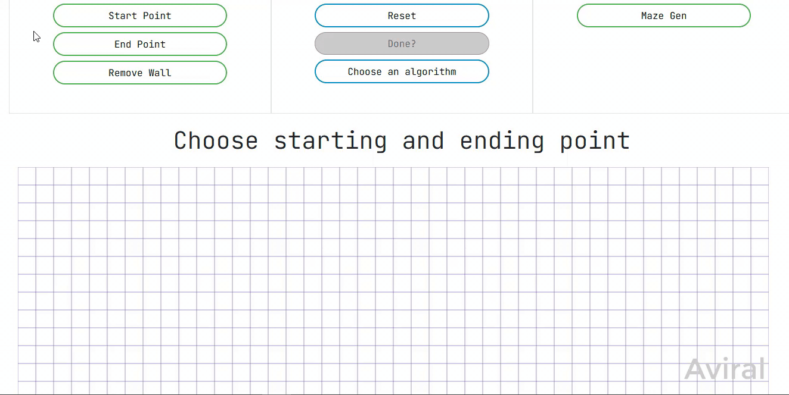

# Path finding Visualization

### Run: 
 - Run index.html (I recommend using a LiveServer to run index.html on `localhost` (sometimes p5JS doesn't loadup correctly on raw index.html))
 
 :)

 ## Instructions:
  - Choose a starting point and an ending point.
  - You can draw walls to obstruct the path (Use Remove Walls to remove unwanted walls)
  - Select an algorithm.
  - Click on Visualize!. 
  - Press Reset to reset everything
  - Added a maze Generation option too.
 
## Example:
  
